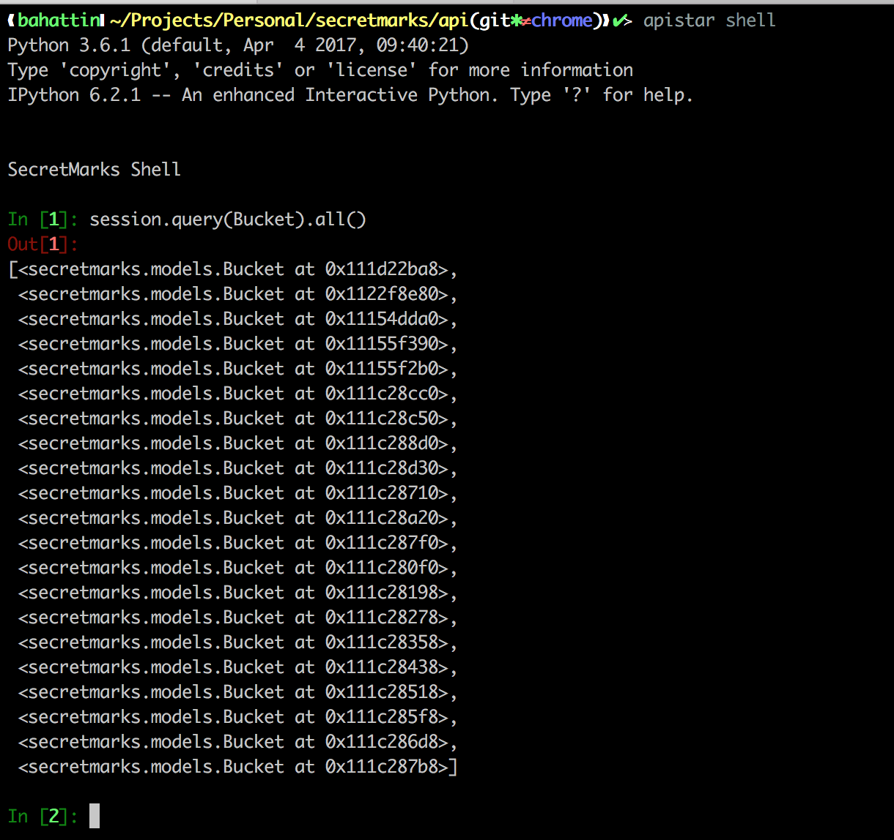

# API Star Shell
API Star Shell inspired by Django

[](https://badge.fury.io/py/apistar-shell)




## Installation

```
$ pip install apistar-shell
```

## Setup & Configuration

- [Django Setup](docs/DJANGO_SETUP.md)
- [SQLAlchemy Setup](docs/SQLALCHEMY_SETUP.md)
- [Common Setup](docs/COMMON_SETUP.md)
- [Configuration](docs/CONFIGURATION.md)

## Usage:

```
$ apistar shell
```
